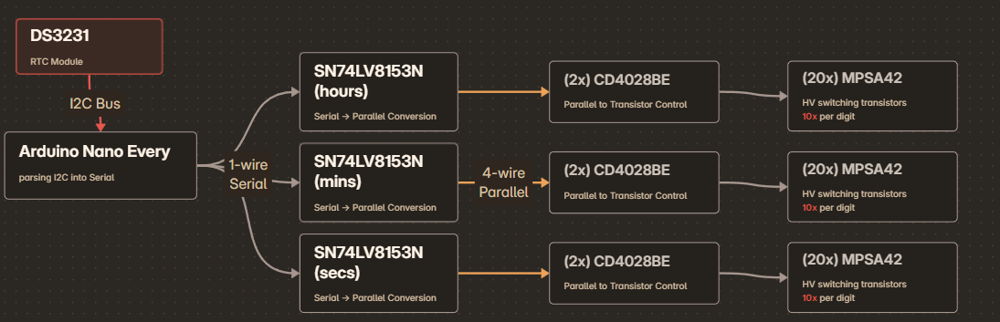
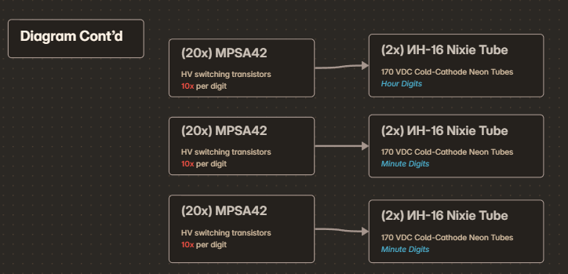
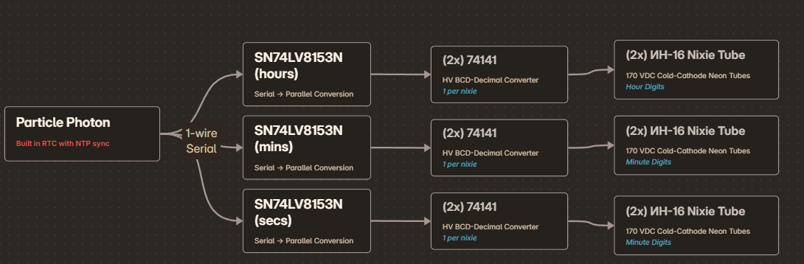

import { Icon } from '@astrojs/starlight/components';

The 2019 Bay Area Maker Faire was my first exposure to <a target="_base" href="https://makerfaire.com/maker/entry/69348/">nixie clocks</a>.
After this point, I found the orange glow and unique way of displaying numbers to be interesting enough that I wanted to make one myself.

This page serves as a breakdown of the past iteration in addition to being a place for me to document progress on the next iteration.

---

## 1st Iteration:

### General Overview:

This first iteration had no prior designing, other than reading over the respective part datasheets and generally laying out the whole circuit on a protoboard.
All code in this iteration was done using Arduino IDE on an Arduino Nano Every microcontroller. 

<figure>
    
    <figcaption id="caption">First part of block diagram</figcaption>
</figure>

<figure>
    
    <figcaption id="caption">Second part of block diagram</figcaption>
</figure>

### Sub-modules:

The way this first iteration worked revolved around the Arduino parsing an I2C signal from the DS3231 RTC, and converting it into a serial signal. This serial line was then converted into BCD using the SN74LV8153N.

Finally, I used a combination of the CD4028BE (which controlled the transistors based on the BCD signal) and the MPSA42 transistors (for high voltage switching) to drive the nixie tubes using the BCD signal.

### Part list:

- **Primary Microcontroller**: <a target="_base" href="https://store-usa.arduino.cc/products/arduino-nano-every">Arduino Nano Every</a>
- Arduino -> Parallel Chips (3 total): <a target="_base" href="https://www.mouser.com/ProductDetail/Texas-Instruments/SN74LV8153N?qs=UG%2F8xqv%2F6WfEPwrU8la10g%3D%3D">SN74LV8153N</a>
- Parallel -> BCD Chips (1 per tube): <a target="_base" href="https://www.mouser.com/ProductDetail/Texas-Instruments/CD4028BE?qs=q81XD9WTF%252BJVO5EmC%252BxsYA%3D%3D">CD4028BE</a>
- BCD -> Nixie High-Power Transistors (1 per nixie pin): <a target="_base" href="https://www.mouser.com/ProductDetail/Diotec-Semiconductor/MPSA42?qs=OlC7AqGiEDnrqj4YbvE3lA%3D%3D">MPSA42</a>
- External RTC Module: <a target="_base" href="https://docs.macetech.com/doku.php/chronodot_v2.0">ChronoDot</a>
- Nixie Tubes: <a target="_base" href="https://www.ebay.com/sch/i.html?_nkw=ИН-16+tube">ИН-16</a>

---

## 2nd Iteration (In-Progress):

#### Objectives:

- Get assembly made into a PCB
- (as an addendum to the above), familiarize myself with KiCad and/or Altium Designer
- Condense design to use less components

<figure>
    
    <figcaption id="caption">Prototype Block Diagram</figcaption>
</figure>

### Parts Overview:

Logic components:
- **Primary Microcontroller**: <a target="_base" href="https://docs.particle.io/reference/datasheets/wi-fi/photon-datasheet/">Particle Photon (not photon 2)</a>
- MCU -> Parallel Chips (3 total): <a target="_base" href="https://www.mouser.com/ProductDetail/Texas-Instruments/SN74LV8153N?qs=UG%2F8xqv%2F6WfEPwrU8la10g%3D%3D">SN74LV8153N</a>
- Optoisolators (not currently being used): <a target="_base" href="https://www.mouser.com/c/optoelectronics/optocouplers-photocouplers/transistor-output-optocouplers/?q=ACPL-844&package%20%2F%20case=PDIP-16 ">ACPL-844-000E PDIP-16 Optocoupler</a>
- Parallel -> **Nixie** (1 per tube): <a target="_base" href="https://neon1.net/nixieclock/sn74141.pdf">Soviet 74141</a>

Nixie Tubes:
- Nixie Tubes: <a target="_base" href="https://www.ebay.com/sch/i.html?_nkw=ИН-16+tube">ИН-16</a>

Power components:
- 24V to 5V converter: <a target="_base" href="https://octopart.com/rs3k-2405dz%2Fh3-recom+power-152992124">RS3K-2405DZ_H3</a>
- 24V to HV converter: <a target="_base" href="https://octopart.com/r24-150b-recom+power-23256604">R24-150B</a>
- HV power adjustment potentiometer: <a target="_base" href="https://www.newark.com/bourns/3296w-1-502lf/trimmer-potentiometer-5kohm-25turn/dp/62J1471?CMP=AFC-OP">3296W-1-502LF</a>