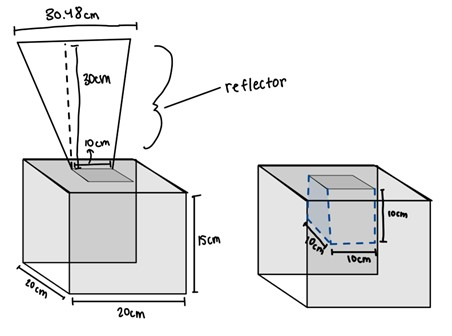
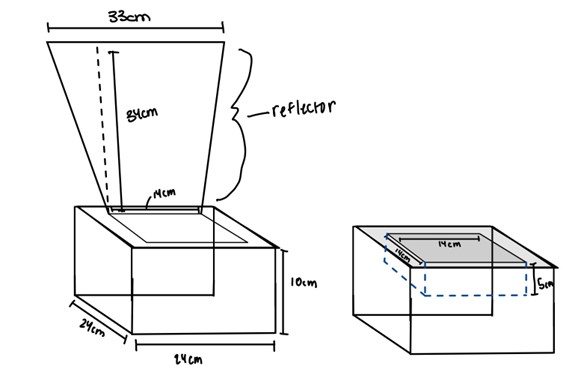
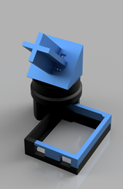
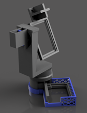
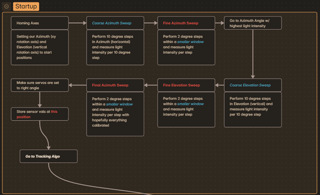
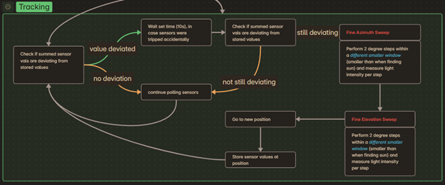

Over my first semester in Engineering, there were two major projects that I'd like to document, the Solar Oven and Solar Tracker. These two projects helped me build my teamwork skills and reinforce my CAD/Coding skills.

## Solar Oven

The Solar Oven project was my first team project in college. We first worked on a base prototype, with dimensions shown below:

<figure>
    
    <figcaption id="caption">Prototype Dimensions, drawn out by a teammate</figcaption>
</figure>


<figure>
    
    <figcaption id="caption">Final Dimensions, drawn out by a teammate</figcaption>
</figure>

This project was primarily a team-building one for me, since at that point I hadn't had a longer-term project that required coordination with other groupmates. Our group was able to delegate roles, set times and expectations, and end up with a final product, though said final product was an overcooked biscuit lol.

---
## Solar Tracker

### Overview

This project was an exercise in applying my Arduino coding skills with my CAD skills to solve a problem. Below are deeper dives into the two respective components.

### Hardware

All of the 3D printed parts for the solar tracker were designed in *Autodesk Fusion*. My main design philosophy going into this project was to create the most compact design possible by leveraging design techniques which could only be manufactured with 3D printing. 

As such, both the prototype and final models contain *print-in-place* (PIP) *bearings* instead of conventional bearings, a design choice which was a double-edged sword. While the PIP bearings did make assembly significantly easier by reducing the number of parts requiring assembly, the mandatory tolerances meant that the tracker had an unavoidable amount of play which reduced its tracking accuracy in both the azimuth and elevation axes.

<figure>
    
    <figcaption id="caption">Prototype single-axis frame</figcaption>
</figure>

The prototype above was a single-axis tracker with an integrated PIP bearing holding the rotation mechanism in place while allowing the encapsulated servo to drive it.

<figure>
    
    <figcaption id="caption">The final frame, I CADed and rendered both models.</figcaption>
</figure>

The final prototype was a dual axis tracker which built off of the prototype design, incorporating a second PIP bearing for rotating both the photoresistors and solar cell in the vertical/elevation axis.

### Software

The software component of the project did prove to be more challenging and less straightforward than the hardware. Although the project only used an array of photoresistors hooked up to an Arduino Uno, my ideas for the algorithm proved to be much more sound on screen than in real life.

<figure>
    
    
    <figcaption id="caption">Code Flowchart for the Solar Tracker</figcaption>
</figure>

As such, I had to settle on a clunkier algorithm (shown in the *Startup* block of the flowchart above) which relied on doing multiple sweeps to lock onto the sun and using smaller passes to subsequently track it.

While the software was *successfully able to track the sun*, there are some improvements I would definitely take if I had more time.

1. Utilize all 4 photoresistors given instead of the two used. This would have upped the accuracy and reduced the number of sensing sweeps neccesary to track.
2. Reduce the number of configurables and functions present. The final code is, in my opinion, bloated from the combination of trying to discretize various functions and trying to tune said functions in integration hell.

With that being said, here are the final code and config file below:

<details>
<summary>Config.h file</summary>
```cpp
#include <Arduino.h>

//Pin Setup
const int azimuthServo = 11;
const int elevationServo = 10;

const int pr1 = A0;
const int pr2 = A1;

//CONFIG VARIABLES
const float stepSize = 10;    //In degrees

const float sensorNoise = 0.25;

const float fineStepSize = 2;
const float finesensewindow = 10.0;
const float courseCorrectwindow = 5.0;

const int RoughdelayTime = 100; //servo wait time
const int FinedelayTime = 20; //servo wait time

//If the tracker detects a deviation, how long should we wait until we check again, in milliseconds
const int bufferDelay = 10000;

//Thresholds for the two photoresistors
const float pr1buffer = 30.0;
const float pr2buffer = 30.0;

//Servo Setup
const int azimuthBounds[2] = {0,180};
const int elevationBounds[2] = {0,90};

const bool debug = true;

```
</details>
---
<details>
<summary>Final Code</summary>
```cpp
/*
Solar Tracker Code Prototype

Written by MoonriseSunset

Last edited: 11/19/2024

PLATFORMIO VERSION

*/

//PIO Setup
#include <Arduino.h>

//Library Setup
#include <Servo.h>

#include "config.h"

//Variables ---------------------------------------------------------------

float pr1data = 0.0;
float pr2data = 0.0;

float sensorSum = 0.0;

float pr1tempref = 0.0;
float pr2tempref = 0.0;

float pr1Buffer[2] = {0.0,0.0};
float pr2Buffer[2] = {0.0,0.0};

//EXTRA VARIABLES, don't touch

float maxIntensity = 0.0;

//Angle Vals:
float theta = 0.0;
float phi = 0.0;

float thetaRef = 0.0;
float phiRef = 0.0;

float thetaFineWindow[2] = {0.0,0.0};
float phiFineWindow[2] = {0.0,0.0};

float Tcourse[2] = {0.0,0.0};
float Pcourse[2] = {0.0,0.0};

Servo azimuth;
Servo elevation;

//Funcs

//Read our photoresistors, return the averaged sum
float getData(int type,int samples){
  float pr1Result = 0.0;
  float pr2Result = 0.0;

  switch (type){
    case 0:
      for (int i = 0; i < samples; i++){
        pr1Result += analogRead(pr1);
        return pr1Result / samples;
      }
    case 1:
      for (int i = 0; i < samples; i++){
        pr2Result += analogRead(pr2);
        return pr2Result / samples;
      }
    case 2:
      for (int i = 0; i < samples; i++){
        pr1Result += analogRead(pr1);
        pr2Result += analogRead(pr2);
      }
      return (pr1Result / samples) + (pr2Result / samples);
    default:
      return -1.0;
  }


  for (int i = 0; i < samples; i++){
    pr1Result += analogRead(pr1);
    pr2Result += analogRead(pr2);
  }

  return (pr1Result / samples) + (pr2Result / samples);
}

//Debug Function
void debugPoint(int infoSelector){
  if(debug){
    switch (infoSelector){
      case 0:
        Serial.print("Angles: ");
        Serial.print(azimuth.read());
        Serial.print("/");
        Serial.print(thetaRef);
        Serial.print(" | ");
        Serial.print(elevation.read());
        Serial.print("/");
        Serial.print(phiRef);
        Serial.print(" | ");
        Serial.print(getData(0,100));
        Serial.print(" | ");
        Serial.print(getData(1,100));
        Serial.print(" | ");
        Serial.print(getData(2,100));
        Serial.print(" / ");
        Serial.print(maxIntensity);
        Serial.println(" | ");
        break;
      case 1:
        Serial.print("Sensor trigger: ");
        Serial.println(sensorSum > maxIntensity);
        break;
      case 2:
        Serial.print("Delta: ");
        Serial.println(maxIntensity - sensorSum);
        break;
      default:
        break;
    }
  }
}

void AzSlowMove(float goal,float step = 1.0,float delayTime = 100.0){
  float currentpoint = azimuth.read();
  if(currentpoint > goal){
    for(float pos = azimuth.read(); pos >= goal; pos -= step){
     azimuth.write(pos);
     delay(delayTime);
    }
    azimuth.write(goal);
  }
  else{
    for(float pos = azimuth.read(); pos <= goal; pos += step){
     azimuth.write(pos);
     delay(delayTime);
    }
    azimuth.write(goal);
  }
}

void ElSlowMove(float goal,float step = 1.0,float delayTime = 100.0){
  float currentpoint = elevation.read();
  if(currentpoint > goal){
    for(float pos = elevation.read(); pos >= goal; pos -= step){
     elevation.write(pos);
     delay(delayTime);
    }
    elevation.write(goal);
  }
  else{
    for(float pos = elevation.read(); pos <= goal; pos += step){
     elevation.write(pos);
     delay(delayTime);
    }
    elevation.write(goal);
  }
}

bool tooFar(){
  if(azimuth.read() > azimuthBounds[1] || azimuth.read() < azimuthBounds[0] || elevation.read() > elevationBounds[1] || elevation.read() < elevationBounds[0]){
    return true;
  } else{
    return false;
  }
}

bool sunMoved(){
  if(analogRead(pr1) < pr1Buffer[0] || analogRead(pr1) > pr1Buffer[1] || analogRead(pr2) < pr2Buffer[0] || analogRead(pr2) > pr2Buffer[1]){
    return true;
  } else{
    return false;
  }
}
float Tbounds[2] = {0.0,0.0};
float Pbounds[2] = {0.0,0.0};

void FineTune(int samples = 100){
  sensorSum = 0.0;

  float pr1tempref = 0.0;
  float pr2tempref = 0.0;

  if(debug){
    Serial.println(" ");
    Serial.println("Fine Tuning");
  }

  AzSlowMove(Tbounds[0],2,FinedelayTime);
  ElSlowMove(Pbounds[1],2,FinedelayTime);

  for(float phi = Pbounds[1]; phi >= Tbounds[0]; phi -= fineStepSize){
    for(float theta = Tbounds[0]; theta <= Tbounds[1]; theta += fineStepSize){

      sensorSum = getData(2,samples);

      if(sensorSum > maxIntensity){
        maxIntensity = sensorSum;
        thetaRef = theta;
        phiRef = phi;
      }

      debugPoint(0);

      AzSlowMove(theta,1,FinedelayTime);
    }
    ElSlowMove(phi,1,FinedelayTime);
  }

  AzSlowMove(thetaRef,1);
  ElSlowMove(phiRef,1);

  pr1tempref = getData(0, samples);
  pr2tempref = getData(1, samples);

  pr1Buffer[0] = pr1tempref - pr1buffer;
  pr1Buffer[1] = pr1tempref + pr1buffer;

  pr2Buffer[0] = pr2tempref - pr2buffer;
  pr2Buffer[1] = pr2tempref + pr2buffer;
}
// Primary Function
void findSun(int samples = 100,bool newAlgo = false){
  float sensorSum = 0.0;

  if(newAlgo){
    int strikes = 0;

    while(strikes <= 4 && azimuth.read() <= azimuthBounds[1] && azimuth.read() >= azimuthBounds[0] && elevation.read() <= elevationBounds[1] && elevation.read() >= elevationBounds[0]){
      sensorSum = getData(2,samples);

      debugPoint(2);

      if(sensorSum > maxIntensity){
        maxIntensity = sensorSum;
        thetaRef = azimuth.read();
        phiRef = elevation.read();
      }
      
      if(sensorSum < maxIntensity - sensorNoise){
        strikes += 1;
        Serial.println("Strike");

      }

      AzSlowMove(azimuth.read()+stepSize,stepSize/2,RoughdelayTime);
      ElSlowMove(elevation.read()-(stepSize)*(0.5),stepSize/2,RoughdelayTime);
   } 

  }else{

    AzSlowMove(azimuthBounds[0],2,FinedelayTime);
    ElSlowMove(elevationBounds[1],2,FinedelayTime);

    for(float phi = elevationBounds[1]; phi >= elevationBounds[0]; phi -= stepSize){
      for(float theta = azimuthBounds[0]; theta <= azimuthBounds[1]; theta += stepSize){

        sensorSum = getData(2,samples);

        if(sensorSum > maxIntensity){
          maxIntensity = sensorSum;
          thetaRef = theta;
          phiRef = phi;
        }

        debugPoint(0);

        AzSlowMove(theta,1,FinedelayTime);
      }
    AzSlowMove(azimuthBounds[0],2,10);
    ElSlowMove(phi,1,RoughdelayTime);
    }
  }
  thetaFineWindow[0] = thetaRef - finesensewindow;
  thetaFineWindow[1] = thetaRef + finesensewindow;

  phiFineWindow[0] = phiRef - finesensewindow;
  phiFineWindow[1] = phiRef + finesensewindow;

  Tbounds[0] = constrain(thetaFineWindow[0],azimuthBounds[0],azimuthBounds[1]);
  Tbounds[1] = constrain(thetaFineWindow[1],azimuthBounds[0],azimuthBounds[1]);

  Pbounds[0] = constrain(phiRef - finesensewindow,elevationBounds[0],elevationBounds[1]);
  Pbounds[1] = constrain(phiRef + finesensewindow,elevationBounds[0],elevationBounds[1]);

  FineTune(10);
}

void setup() {

  //Debug setup
  if(debug){
    Serial.begin(9600);
    while(!Serial);
  }

  //Pin Setup
  pinMode(azimuthServo, OUTPUT);
  pinMode(elevationServo, OUTPUT);

  pinMode(pr1, INPUT);
  pinMode(pr2, INPUT);

  //Servo Startup
  azimuth.write(azimuth.read());
  elevation.write(elevation.read());

  azimuth.attach(azimuthServo);
  elevation.attach(elevationServo);

  //Homing
  AzSlowMove(azimuthBounds[0],2,FinedelayTime);
  ElSlowMove(elevationBounds[1],2,FinedelayTime);

  //Wait for a little so people can get out of the way so the tracker can run unobstructed
  delay(5000);
}

bool started = false;

void loop() {

  if(!started){
    started = true;
    findSun(100,true);
  }

  debugPoint(1);

  if(analogRead(pr1) < pr1Buffer[0] || analogRead(pr1) > pr1Buffer[1] || analogRead(pr2) < pr2Buffer[0] || analogRead(pr2) > pr2Buffer[1]){
    Serial.println(pr1Buffer[0]-1);
    //Wait a little, in case the deviation wasn't caused by the sun, maybe it was caused by a human
    delay(bufferDelay);
    if(analogRead(pr1) < pr1Buffer[0] || analogRead(pr1) > pr1Buffer[1] || analogRead(pr2) < pr2Buffer[0] || analogRead(pr2) > pr2Buffer[1]){
      Tcourse[0] = thetaRef - courseCorrectwindow;
      Tcourse[1] = thetaRef + courseCorrectwindow;
      Pcourse[0] = phiRef - courseCorrectwindow;
      Pcourse[1] = phiRef + courseCorrectwindow;

      Tbounds[0] = constrain(Tcourse[0],azimuthBounds[0],azimuthBounds[1]);
      Tbounds[1] = constrain(Tcourse[1],azimuthBounds[0],azimuthBounds[1]);
      Pbounds[0] = constrain(Pcourse[0],elevationBounds[0],elevationBounds[1]);
      Pbounds[1] = constrain(Pcourse[1],elevationBounds[0],elevationBounds[1]);

      FineTune(100);
    }
  }
}
```
</details>