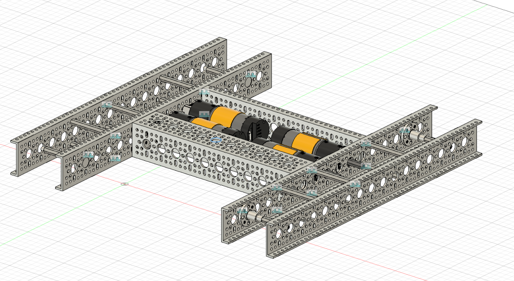
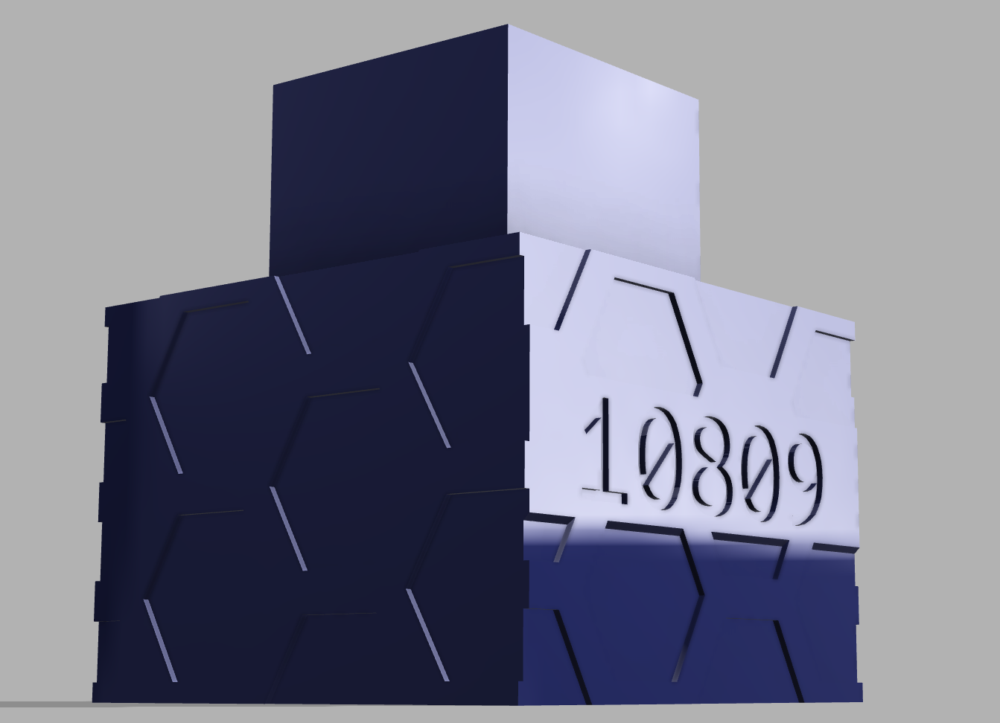
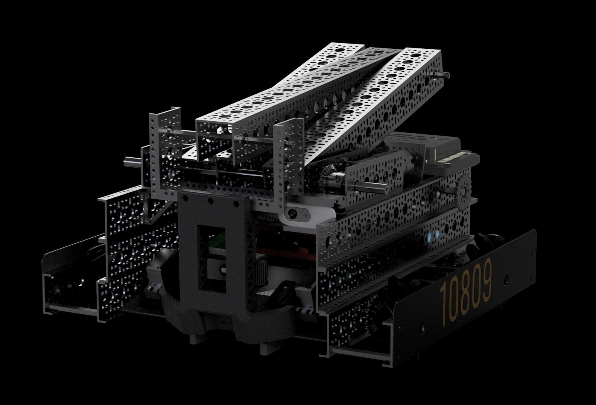

import { Steps } from '@astrojs/starlight/components';

I've participated in FIRST Tech Challange Robotics for *5 years*, from 8-12th grade. I've attempted to document all I can below from those years :)

## Timeline

<Steps>
1. **2023-2024** Season: [#10809 Crow Force](#10809-crow-force)
    - [Hardware](#hardware) Member with contributions to [Software](#Software)
2. **2020-2023** Season: [#8097 Botcats](#8097-botcats)
    - 2022-23: *Design Lead*
        - Managed design of the robot both in software and hardware
    - 2021-22: *Hardware Lead*
        - Overall managing of robot design in addition to coordinating with Software Branch
3. **2019-2020** Season: [#16105 Darkness Rising](#16105-darkness-rising)
    - Hardware member, contributing to building the robot and designing/printing parts

</Steps>

## #10809 Crow Force

For my final year in robotics, I broke with the usual standard of people sticking to one "branch" of a team. More specifically, instead of focusing on just hardware design or outreach, I contributed to:

### Software

During the season, I was interested in making decent looking CSS sites, and as such saw an opportunity to make a simple site for the team.

<iframe src="https://crowforce.github.io" style="height:700px;width:700px"></iframe>

Using my existing [stylesheet template](../../../personal/2-small-projects#niagara), I created a framework that both my teammates and mentors could add onto.

---
### Hardware

Over the summer leading up to the season, I threw together a rough chassis design so that once the season properly started, we could focus on more important things like scoring systems.

<figure>
    
    <figcaption id="caption">Summer Chassis Prototype</figcaption>
</figure>

Throughout the season, I was designing secondary 3D-printed parts, such as a battery holder, dual-sided markers, and electrically insulating sideplates. 

<figure>
    
    <figcaption id="caption">Blue Alliance Marker, designed and rendered by me</figcaption>
</figure>

Towards the end of the season, I performed most of the render's for our team's portfolio, mainly rending photos of the robot itself.

<figure>
    
    <figcaption id="caption">Render of the front of the robot</figcaption>
</figure>
<figure>
    
    <figcaption id="caption">Rear robot render, showing off our electronics</figcaption>
</figure>

---
## #8097 Botcats

This section is a bit terse since I no longer have access to past images and documentation.

(WIP)

---
## #16105 Darkness Rising

(WIP)
